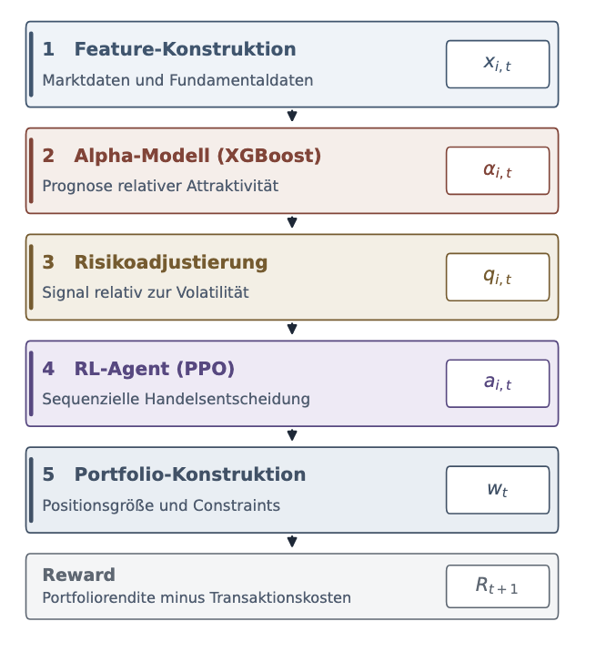

<div align="center">

# 📈 RL Fundamental Trading


</div>

---

## 📑 Table of Contents

- [🚀 Prerequisites](#-prerequisites)
- [⚡ Quick Start](#-quick-start)
- [🧠 Project Overview](#-project-overview)
- [🔄 Approach / Architecture](#-approach--architecture)
- [📁 Repository Structure](#-repository-structure)
- [📊 Experiments / Results](#-experiments--results)

---

## 🚀 Prerequisites

| Voraussetzung | Details |
| --- | --- |
| **Python 3.13** | Version ist in [.python-version](.python-version) fixiert (`requires-python >=3.13,<3.14`). |
| **[uv](https://docs.astral.sh/uv/)** | Package- und Environment-Manager. Verwaltet Python-Version, `.venv` und `uv.lock`. |
| **Git** | Wird für den Klon **und** für die als Git-Abhängigkeit eingebundene Data-Pipeline benötigt. |

---

## ⚡ Quick Start

Die folgende Reihenfolge bringt das Projekt von Null bis zu trainiertem Agenten und Evaluation. Der einfachste, empfohlene Weg nutzt das volle Feature-Set (Markt **+** Fundamentaldaten).

**1. Repository klonen**

```bash
git clone https://github.com/VincInfo/rl-fundamental-trading.git
cd rl-fundamental-trading
```

**2. Umgebung einrichten** (Python 3.13 via uv)

```bash
# uv installieren, falls noch nicht vorhanden (macOS/Linux):
curl -LsSf https://astral.sh/uv/install.sh | sh

uv python install        # installiert Python 3.13 aus .python-version
```

**3. Dependencies installieren**

```bash
uv sync                  # erstellt .venv und installiert alle Abhängigkeiten
```


**4. Daten vorbereiten / prüfen** — die Rohdaten sind bereits im Data-Pipeline-Paket gebündelt. Dieser Schritt verifiziert nur, dass die Splits geladen werden:

```bash
uv run python pipeline/run_fundamentals_pipeline.py
# Erwartete Ausgabe: train/validation/test-Shapes des Datensatzes
```

**5. Alpha-Modell trainieren** (XGBoost, volles Feature-Set)

```bash
uv run python pipeline/train_alpha_model.py
# → Artefakt: models/alpha/artifacts/ · Metriken: eval/alpha_training_metrics.json
# Konsole zeigt u. a. den Information Coefficient (ic) auf dem Validation-Split
```

**6. RL-Agent trainieren** (PPO, nutzt das Alpha-Artefakt aus Schritt 6)

```bash
# Schneller Smoke-Test (~40 s auf CPU):
OMP_NUM_THREADS=1 KMP_DUPLICATE_LIB_OK=TRUE \
  uv run python pipeline/train_ppo.py --timesteps 20000

# Vollständiger Lauf (Default = 200_000 Timesteps):
OMP_NUM_THREADS=1 KMP_DUPLICATE_LIB_OK=TRUE \
  uv run python pipeline/train_ppo.py
# → Artefakt: models/rl/artifacts/ppo_agent · Metriken: eval/ppo_training_metrics.json
#   Portfolio-Verläufe: eval/ppo_train_portfolio.csv, eval/ppo_validation_portfolio.csv
```

> Unter Linux/Windows können die `OMP_*`-Prefixe in der Regel entfallen.

**7. Evaluation** (Alpha-Qualität + regelbasierte Baselines auf Train/Validation)

```bash
uv run python pipeline/eval_comparison.py       # → eval/comparison.json
uv run python pipeline/eval_rule_baselines.py   # → eval/alpha_rule_baselines.json
```

**8. (Optional) Tests ausführen**

```bash
KMP_DUPLICATE_LIB_OK=TRUE uv run pytest
```

---

## 🧠 Project Overview

Algorithmischer Handel trifft Kauf-, Verkaufs- und Halteentscheidungen datengetrieben statt diskretionär. Klassische RL-Handelssysteme stützen sich dabei meist nur auf Kursdaten und technische Indikatoren und berücksichtigen die wirtschaftliche Lage eines Unternehmens kaum. **Fundamentaldaten** aus regulatorischen Berichten (Umsatz, Profitabilität, Cashflow, Verschuldung) sind eine komplementäre Informationsquelle – erscheinen aber nur quartalsweise und müssen *point-in-time* zugeordnet werden, um Look-Ahead-Bias zu vermeiden.

**Forschungsfrage:**

> *Welchen zusätzlichen Nutzen liefern Fundamentaldaten gegenüber reinen Marktdaten für datengetriebene Handelsentscheidungen in einem hybriden System aus Alpha-Prognose und Reinforcement Learning?*

Der Ansatz ist bewusst **modular und hybrid**: Ein überwachtes **XGBoost-Alpha-Modell** prognostiziert die relative Attraktivität (aktive 20-Tage-Rendite) jeder Aktie, während ein **Reinforcement-Learning-Agent** die sequentielle Handelsentscheidung übernimmt. Untersucht werden 20 Unternehmen aus fünf Sektoren; Marktdaten stammen von Yahoo Finance, Fundamentaldaten aus den SEC-EDGAR Company Facts (10-Q / 10-K).

---

## 🔄 Approach / Architecture


---

## 📁 Repository Structure

```text
rl-fundamental-trading/
├── pipeline/                  # Ausführbare Entrypoints (CLI)
│   ├── run_fundamentals_pipeline.py   # Daten laden / prüfen
│   ├── train_alpha_model.py           # XGBoost-Alpha-Modell trainieren
│   ├── train_ppo.py                   # RL-Agent trainieren (PPO/SAC)
│   ├── eval_comparison.py             # Alpha-Qualität + Regel-Grid
│   └── eval_rule_baselines.py         # Regelbasierte Baselines
├── models/
│   ├── alpha/                 # XGBoost-Alpha-Modell (Features, Scoring, Config, Artefakte)
│   └── rl/                    # RL-Setup: Envs, Panel, Residual/Imitation, Training, Config
├── eval/                      # Evaluationslogik + gespeicherte Metriken (JSON/CSV)
├── tests/                     # Pytest-Suite (Env, Features, Alpha, Baselines)
├── notebooks/                 # Explorative Analysen
├── PAPER_RL/                  # Projektpaper (LaTeX-Quellen)
├── ARCHITECTURE.md            # Detaillierte Systemarchitektur
├── WORKFLOW.md                # Git-/Beitragsworkflow
└── README.md
```

---

## 📊 Experiments / Results

> Vollständige Evaluationsstrategie: [eval/README.md](eval/README.md) ·
---